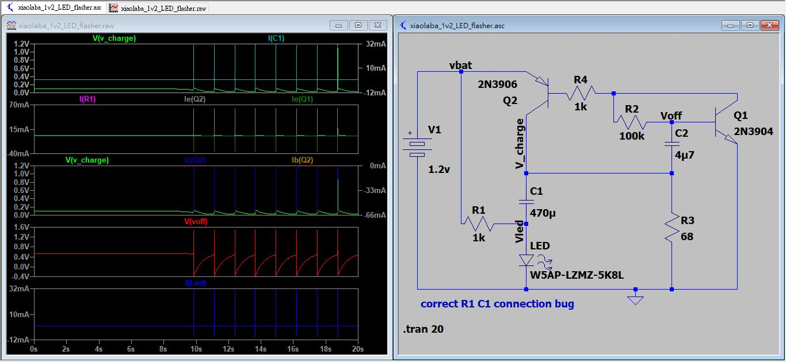

# LTspice-xiaolaba_1.2v_LED_flasher_pnp_npn
twp transistors (PNP + NPN), charge pump type LED flasher, 1.2V battery, 1.0V not working.  
learning material.  

搭棚  
  

搭棚.pdf  
[xiaolaba_1.2v_LED_flasher.pdf](xiaolaba_1.2v_LED_flasher.pdf)  

LTspeice source code  
  

simulation, waverform  (corrected R1 C1 connection)  
  

simulation, waverform  (wrong R1 C1 connection)

